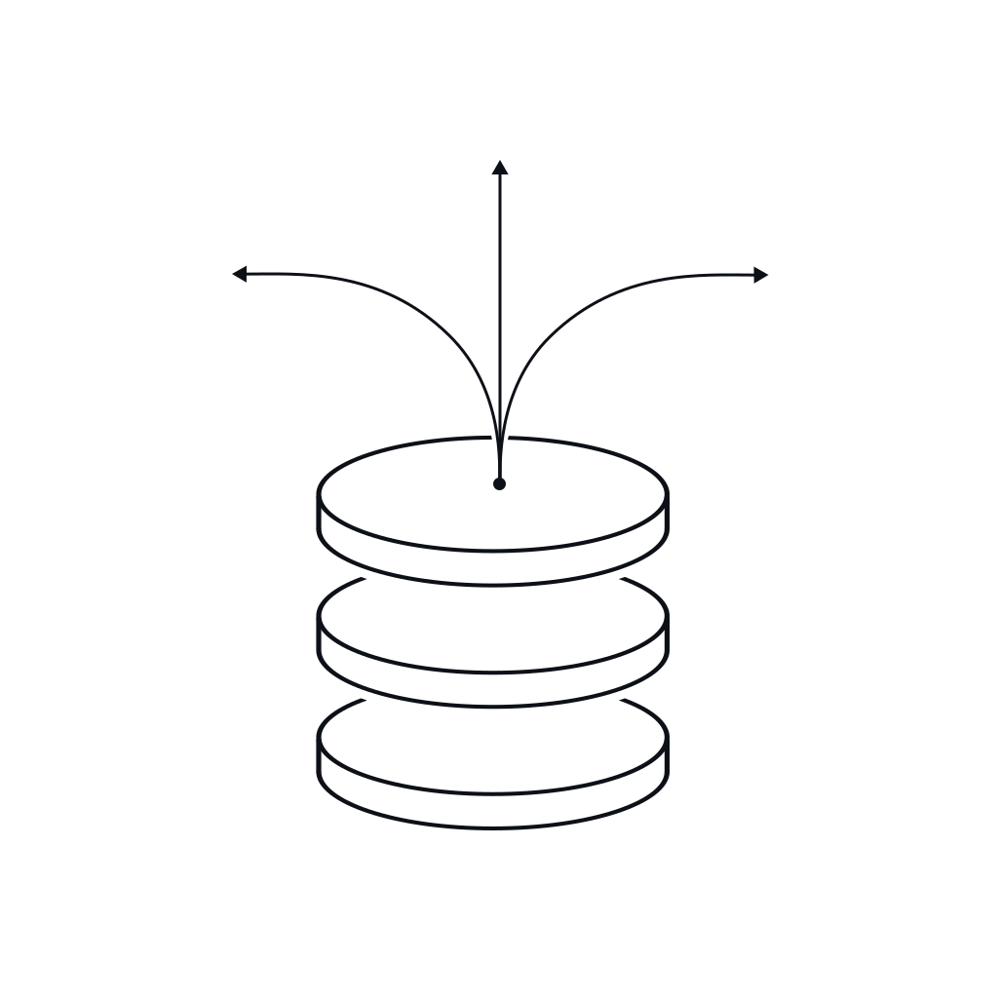
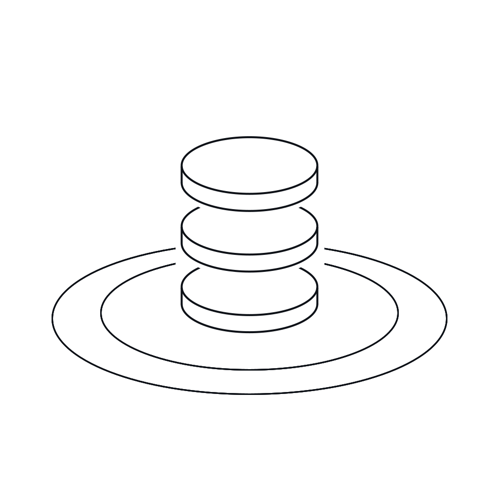
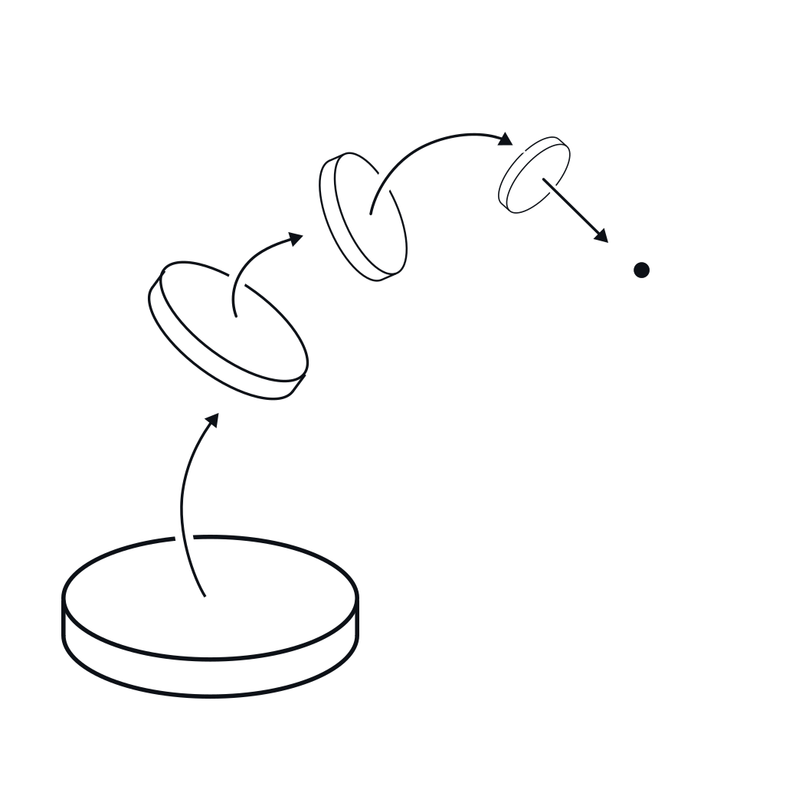
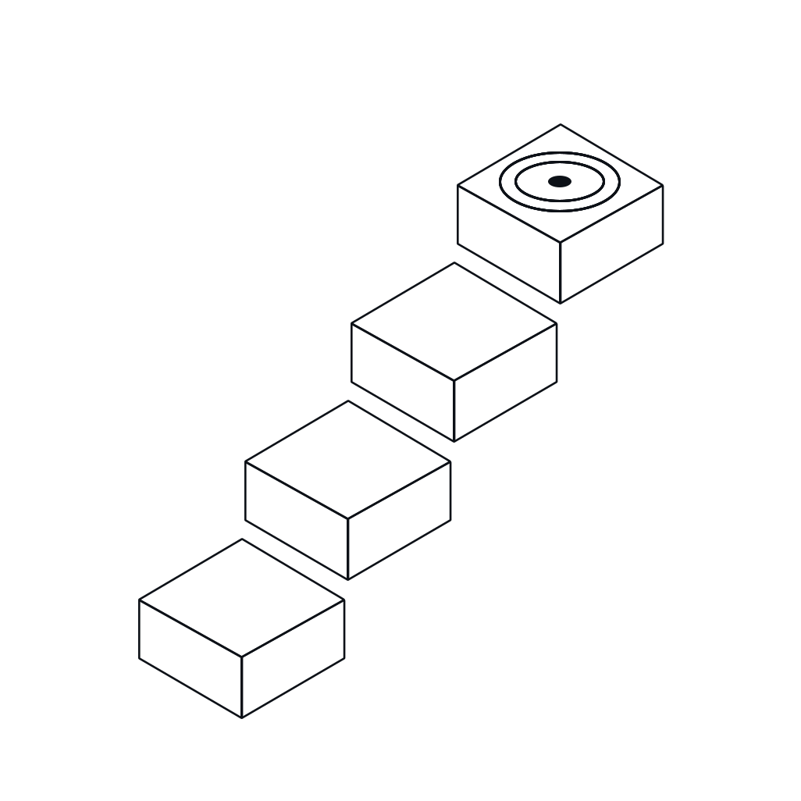

<p align="center">
  <picture>
    <source media="(prefers-color-scheme: dark)" srcset="assets/brand/site/hero-parsec-dark.svg">
    
  </picture>
</p>

<p align="center"><sub><b>PARSEC · CONTEXT FOR CODING AGENTS</b></sub></p>

<h1 align="center">A new way to go farther.</h1>

<p align="center">
Parsec understands that doing more shouldn’t require more, and the way forward
for all of us is through efficiency, not effort. Reducing costs with bespoke
plans that provide the value that fits your project, available to all, for all.
</p>

<p align="center">
  <a href="#install"><b>Install</b></a> ·
  <a href="https://app.getparsec.ai/"><b>Sign in</b></a> ·
  <a href="https://github.com/daseinlabs/code-compression-bench"><b>Read the benchmark</b></a>
</p>

<p align="center">
  <a href="https://github.com/daseinlabs/parsec/releases/latest"></a>
  <a href="https://github.com/daseinlabs/parsec/actions/workflows/ci.yml"></a>
  <a href="LICENSE"></a>
</p>

parsec is a local proxy and plugin for Claude Code, OpenCode, Codex CLI, pi,
and Claude Desktop that cuts the tokens your agent spends per turn: it blocks
wasteful re-reads, breaks command loops, and (with scoring enabled) curates the
conversation context before each request, cache-safely. Savings are measured
per request against the provider's own token counter, never estimated.

Everything runs on your machine with your own credentials. Model traffic never
touches anyone else's infrastructure.

## Cheaper. Faster. More solved.

<table align="center">
  <tr>
    <td align="center" width="33%"><sub><b>CHEAPER</b></sub><h2>−39%</h2>$89.65 vs $147.30 total cost<br><sub>$1.45 per solved task, the lowest of all six arms tested.</sub></td>
    <td align="center" width="33%"><sub><b>FASTER</b></sub><h2>−25%</h2>10.8 hours vs 14.4 hours<br><sub>The same task set, completed 3.6 hours sooner.</sub></td>
    <td align="center" width="33%"><sub><b>BETTER</b></sub><h2>62/100</h2>Up from 57 without compression<br><sub>Five more working fixes, verified by the official grader.</sub></td>
  </tr>
</table>

<p align="center"><sub>100 SWE-bench Verified tasks, one fixed model (Claude Sonnet 4.6), the
official Docker grader, and cache-aware pricing. Only the compression layer
changes. <a href="https://github.com/daseinlabs/code-compression-bench">Read the benchmark →</a></sub></p>

## How it works

<table align="center">
  <tr>
    <td align="center" width="25%" valign="top">
      <picture>
        <source media="(prefers-color-scheme: dark)" srcset="assets/brand/site/agent-context-dark.svg">
        
      </picture><br>
      <b>Agent context</b><br>
      <sub>File reads, search results, tool output, and thinking accumulate with every turn.</sub>
    </td>
    <td align="center" width="25%" valign="top">
      <picture>
        <source media="(prefers-color-scheme: dark)" srcset="assets/brand/site/learned-curator-dark.svg">
        
      </picture><br>
      <b>Learned curator</b><br>
      <sub>parsec scores each chunk and removes context the agent is unlikely to use.</sub>
    </td>
    <td align="center" width="25%" valign="top">
      <picture>
        <source media="(prefers-color-scheme: dark)" srcset="assets/brand/site/original-content-dark.svg">
        
      </picture><br>
      <b>Original content</b><br>
      <sub>Kept content stays byte-exact. Your prompts and the agent’s answers stay untouched.</sub>
    </td>
    <td align="center" width="25%" valign="top">
      <picture>
        <source media="(prefers-color-scheme: dark)" srcset="assets/brand/site/measured-results-dark.svg">
        
      </picture><br>
      <b>Measured results</b><br>
      <sub>Less context to process: lower cost, faster runs, more solved tasks.</sub>
    </td>
  </tr>
</table>

## Install

<table align="center">
  <tr>
    <td align="center" width="33%">
      <a href="#macos"><picture>
    <source media="(prefers-color-scheme: dark)" srcset="assets/brand/os/macos-dark.svg">
    
  </picture></a><br>
      <b>macOS</b><br><sub>Apple silicon</sub>
    </td>
    <td align="center" width="33%">
      <a href="#windows"><picture>
    <source media="(prefers-color-scheme: dark)" srcset="assets/brand/os/windows-dark.svg">
    
  </picture></a><br>
      <b>Windows</b><br><sub>x64</sub>
    </td>
    <td align="center" width="33%">
      <a href="#linux"><picture>
    <source media="(prefers-color-scheme: dark)" srcset="assets/brand/os/linux-dark.svg">
    
  </picture></a><br>
      <b>Linux</b><br><sub>x64</sub>
    </td>
  </tr>
  <tr>
    <td align="center"><a href="https://github.com/daseinlabs/parsec/releases/latest"><code>.pkg</code> installer</a></td>
    <td align="center"><a href="https://github.com/daseinlabs/parsec/releases/latest"><code>setup.exe</code> installer</a></td>
    <td align="center"><a href="#linux">one-line script</a></td>
  </tr>
</table>

Every installer signs you in when it opens the browser, then installs the
`parsec` binary and the Claude Code plugin. The native installers are on the
[releases page](https://github.com/daseinlabs/parsec/releases/latest) next to
the raw binaries the scripts download.

### macOS

Download `parsec-<version>-macos-arm64.pkg` from the
[releases page](https://github.com/daseinlabs/parsec/releases/latest) and
open it, or run:

```sh
curl -fsSL https://raw.githubusercontent.com/daseinlabs/parsec/main/scripts/install.sh | bash
```

### Windows

Download `parsec-<version>-windows-x64-setup.exe` from the
[releases page](https://github.com/daseinlabs/parsec/releases/latest) and run
it, or in PowerShell:

```powershell
irm https://raw.githubusercontent.com/daseinlabs/parsec/main/scripts/install.ps1 | iex
```

### Linux

```sh
curl -fsSL https://raw.githubusercontent.com/daseinlabs/parsec/main/scripts/install.sh | bash
```

The script fetches the `parsec-linux-x64` binary for the latest release and
installs the plugin.

### From the Claude Code CLI

```sh
claude plugin marketplace add https://github.com/daseinlabs/parsec
claude plugin install parsec@parsec-marketplace
```

The plugin fetches its binary from this repository's GitHub Releases on first
use (sha256-verified against the release's `manifest.json`), so a marketplace
install needs nothing else. Installed from the old `daseinlabs/plugins`
marketplace? That repository is frozen at its last release. Switch once:

```sh
claude plugin marketplace remove parsec-marketplace
claude plugin marketplace add https://github.com/daseinlabs/parsec
claude plugin install parsec@parsec-marketplace
```

Then in a session: `/parsec:setup` routes your agent through the proxy,
`/parsec:savings` shows what it saved, `/parsec:share --preview` shows exactly
what opt-in telemetry would upload before anything leaves.

## What parsec sends

parsec is a proxy, so this section is the contract. Everything below can be
verified in `packages/proxy/src` and the schemas in `packages/contracts`.

| When | What leaves your machine | Where | Off switch |
|---|---|---|---|
| Always | Your model requests, with your own auth headers | The provider you already use (`api.anthropic.com` by default) | n/a — this is your agent's own traffic |
| Every 6 hours while the proxy is idle | A **release check**: an unauthenticated download of the latest `manifest.json` from this repository's GitHub Releases, and the new binary when there is one. Only a proxy running as `~/.parsec/bin/parsec` updates itself. | GitHub | `PARSEC_AUTO_UPDATE=0` |
| Always, no key needed | An anonymous **install ping**: random install id, parsec version, OS, arch, list of configured harnesses. Sent at setup, on key changes, and every 6 hours while the proxy runs. Never your API key. | parsec platform | `PARSEC_INSTALL_REPORT=0` or `DO_NOT_TRACK=1` |
| With scoring enabled | **Chunk text** (each chunk capped at 2000 chars) plus structural features, for keep/cut scoring. The response is scores; the service does not learn what was dropped. | parsec scoring API | `PARSEC_FREEZE=off`, or run with no scoring endpoint |
| With a parsec key | **Savings-ledger rows**: token counts per request, model, harness, conversation and request ids. No prompt text. | parsec platform | remove the key (`/parsec:key`) or unset `PARSEC_PLATFORM_URL` |
| Opt-in only | Featurized trace sharing (`/parsec:share`) | parsec platform | Off by default; `--preview` shows the exact bytes first |

`~/.parsec/` holds local state: the savings ledger, score memo (hashes and
quantized scores only), and recordings if you enable `PARSEC_RECORD_DIR`.
Delete it whenever you like.

## Layout

| Package | Language | What |
|---|---|---|
| `packages/engine` | Rust | Chunking, featurization, deterministic freezing, readout. Pure library. |
| `packages/proxy` | Rust | The `parsec` binary: local proxy, hooks, MCP server, status line, harness setup. |
| `packages/mapgen` | Rust | Deterministic repo maps, outlines, symbol lookup for the explore agent. |
| `packages/contracts` | JSON Schema | Cross-language schemas: scoring API, savings ledger, telemetry, install report. |
| `packages/plugin` | Markdown/JSON | The Claude Code plugin (agents, skills, hooks, launcher shims). |
| `packages/opencode-plugin` | JS | OpenCode plugin shim. |
| `packages/pi-extension` | TS | pi extension: one dependency-free file, embedded into the binary, that revives the proxy and bridges pi's tool events to the parsec hooks. |
| `packages/installer` | Shell/Inno | Native macOS and Windows installer sources. |
| `packages/brain` | Python | The scoring service: GNN inference over a curator checkpoint, self-validating bundle, calibrated tau. Self-hostable. |

The training pipeline and the account platform are separate, closed
components. Everything here talks to them only over the contracts in
`packages/contracts`, and runs without them.

## Self-host the scoring service

The proxy runs without any scoring service (no-reread hook, loop breaker,
savings ledger). Curation needs one, and you can run it yourself: it is
`packages/brain`, one Python process holding the curator checkpoint and the
bge-large encoder.

The released curator checkpoints live on the Hugging Face Hub at
[huggingface.co/parsecai/curator](https://huggingface.co/parsecai/curator).
Use `curator_v7-9_10nn_prod.pt`: it is self-contained and needs no neighbor
store at serve time. The model card lists the other checkpoint and its
calibration tables.

```sh
# 1. a curator checkpoint — fetched and cached via huggingface_hub, or a local path
pip install huggingface_hub
export PARSEC_CKPT=hf://parsecai/curator/curator_v7-9_10nn_prod.pt
# 2. the service (in-process bge-large; CPU works, a GPU is faster)
docker compose up -d                                   # http://127.0.0.1:8090
# 3. point the proxy at it
export PARSEC_BRAIN_URL=http://127.0.0.1:8090
```

`packages/brain/README.md` has the bare-uvicorn form, the auth options, and
a Cloud Run recipe. A self-hosted brain is where the chunk text in "What
parsec sends" goes; with your own host, nothing leaves your infrastructure.

## Build

```sh
cargo build --release   # engine, proxy (the `parsec` binary), mapgen
make check              # fmt + clippy + tests, same flags CI runs
make plugin             # build and install a local plugin binary for `claude --plugin-dir`
```

Rust 1.98 is pinned in `rust-toolchain.toml`. No model download, no network
needed for the Rust test suite. The scoring service's tests
(`make brain-test`) run their hermetic subset without a checkpoint. See
`CONTRIBUTING.md` for the dev loop.

## Invariants

These are what the test suite protects; see `DIRECTION.md §8`.

1. **Cache stability**: replayed conversations are byte-identical on every
   previously served turn.
2. **Parity**: the Rust port matches the reference implementation
   byte-for-byte on freezing and vector-for-vector on featurization.
3. **Fail open, but measured**: every layer degrades to passthrough, and
   fail-open events are counted.
4. **Measurement honesty**: savings only from the `count_tokens`
   counterfactual, never a modeled baseline.

## License

MIT, see `LICENSE`. Third-party notices and trademark note in
`THIRD_PARTY.md`. Security reports: `SECURITY.md`.
